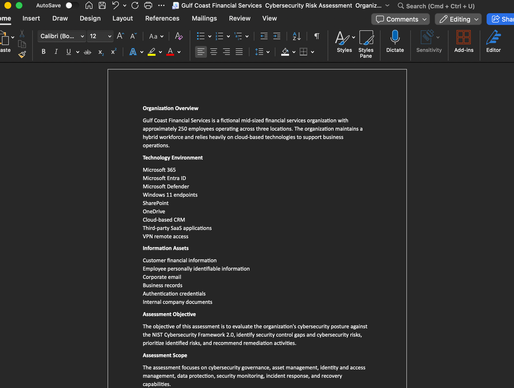
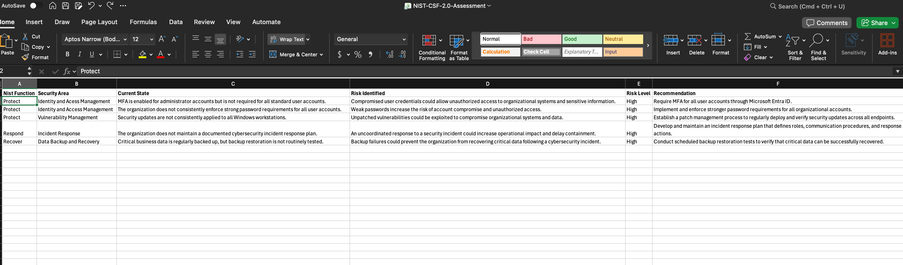
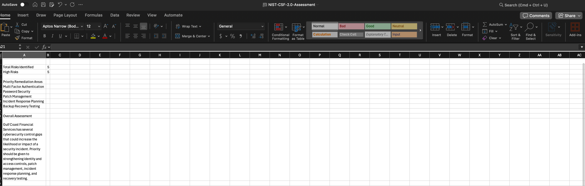

# NIST Cybersecurity Framework (CSF) Risk Assessment

## Project Overview

This project demonstrates a basic cybersecurity risk assessment using the NIST Cybersecurity Framework 2.0. The assessment was performed against Gulf Coast Financial Services, a fictional financial services organization with approximately 250 employees.

The objective of the assessment was to identify cybersecurity control gaps, evaluate the risks associated with those gaps, assign risk levels, and recommend remediation actions to reduce organizational risk.

## Organization Profile

Gulf Coast Financial Services operates across three locations and supports a hybrid workforce. The organization relies primarily on cloud based technologies and handles sensitive customer and employee information.

The technology environment includes:

* Microsoft 365
* Microsoft Entra ID
* Microsoft Defender
* Windows 11 endpoints
* SharePoint and OneDrive
* Cloud based business applications
* Third party SaaS applications
* VPN remote access

Sensitive information includes customer financial information, employee personally identifiable information, authentication credentials, corporate email, and internal business records.

## Assessment Methodology

The NIST Cybersecurity Framework 2.0 was used as the foundation for evaluating the organization's cybersecurity posture.

The assessment process included:

* Reviewing the current state of selected cybersecurity controls
* Identifying security control gaps
* Determining the cybersecurity risks associated with each gap
* Assigning a risk level based on potential organizational impact
* Mapping findings to applicable NIST CSF 2.0 functions
* Developing remediation recommendations to reduce identified risks

The assessment included findings within the Protect, Respond, and Recover functions of the NIST Cybersecurity Framework.

## Key Findings

### 1. Multi Factor Authentication

MFA was enabled for administrator accounts but was not required for all standard user accounts.

**Risk:** Compromised user credentials could allow unauthorized access to organizational systems and sensitive information.

**Risk Level:** High

**Recommendation:** Require MFA for all organizational user accounts through Microsoft Entra ID.

### 2. Password Security

Strong password requirements were not consistently enforced across organizational accounts.

**Risk:** Weak passwords increase the likelihood of account compromise and unauthorized access.

**Risk Level:** High

**Recommendation:** Implement and enforce stronger password requirements for all organizational accounts.

### 3. Patch Management

Security updates were not consistently applied to all Windows workstations.

**Risk:** Known vulnerabilities on unpatched systems could be exploited to compromise organizational systems and data.

**Risk Level:** High

**Recommendation:** Establish a patch management process to regularly deploy and verify security updates across organizational endpoints.

### 4. Incident Response

The organization did not maintain a documented cybersecurity incident response plan.

**Risk:** An uncoordinated response could increase the operational impact of a cybersecurity incident and delay containment.

**Risk Level:** High

**Recommendation:** Develop and maintain an incident response plan defining responsibilities, communication procedures, and response actions.

### 5. Backup and Recovery

Critical business information was regularly backed up, but restoration testing was not routinely performed.

**Risk:** Backup failures could prevent the organization from recovering critical information following a cybersecurity incident.

**Risk Level:** High

**Recommendation:** Conduct scheduled restoration testing to verify that critical information can be successfully recovered.

## Risk Summary

The assessment identified five high risk findings requiring remediation.

Priority remediation areas included:

* Multi factor authentication
* Password security
* Patch management
* Incident response planning
* Backup recovery testing

These findings demonstrate that cybersecurity risk extends beyond technical vulnerabilities. Effective risk management also requires appropriate security controls, documented processes, and verification that existing controls operate as intended.

## Remediation Priorities

Based on the assessment, Gulf Coast Financial Services should prioritize identity and access management improvements by expanding MFA coverage and strengthening password requirements.

The organization should also establish consistent patch management procedures, develop a documented incident response plan, and routinely test backup restoration capabilities.

Addressing these areas would reduce the likelihood and potential impact of account compromise, vulnerability exploitation, ineffective incident response, and data loss.

## Skills Demonstrated

* Governance, Risk, and Compliance
* NIST Cybersecurity Framework 2.0
* Cybersecurity Risk Assessment
* Risk Identification
* Risk Analysis
* Risk Prioritization
* Security Control Evaluation
* Identity and Access Management
* Vulnerability Management
* Incident Response
* Remediation Planning
* Security Documentation

## Project Files

The repository includes:

* NIST CSF 2.0 Risk Assessment spreadsheet
* Gulf Coast Financial Services organization profile
* Risk assessment summary
* Supporting project screenshots

## Key Takeaways

This project provided hands on experience applying a cybersecurity framework to a business scenario rather than evaluating security issues solely from a technical perspective.

The assessment demonstrated how security control gaps can be translated into organizational risks, prioritized based on potential impact, and addressed through appropriate remediation recommendations.

## Disclaimer

Gulf Coast Financial Services is a fictional organization created solely for educational and portfolio purposes. No real company data, confidential information, or proprietary information was used in this assessment.

